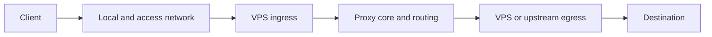

# NetOps

Evidence-led VPS and proxy diagnostics, controlled changes, and rollback for
Codex and the command line.

[English](README.md) | [简体中文](README.zh-CN.md)

[](https://github.com/Con-Benksl/NetOps/actions/workflows/test.yml)
[](https://github.com/Con-Benksl/NetOps/releases/latest)

[](LICENSE)

Proxy failures rarely belong to one box. A timeout may start on the client, in
the access network, at DNS, on the VPS, inside Xray routing, at an upstream
egress, or at the destination. NetOps records what each observable segment can
prove instead of turning one ping, traceroute, or public-IP lookup into a
verdict.

The repository contains a Chinese-first Agent Skill collection and a
standard-library-only Python CLI. Beginners can describe the symptom to Codex.
Operators can collect machine-readable evidence, compare two observations,
export redacted support bundles, and run reviewed remote transactions with
backup and rollback.

> [!IMPORTANT]
> Use NetOps only on systems you own or are explicitly authorized to manage.
> It is not a port scanner, credential tester, traffic interceptor, or
> substitute for provider-side telemetry.

## Start here

Choose the interface that matches how you work:

| Interface | Best for | Requirements |
| --- | --- | --- |
| Codex Skills | Natural-language diagnosis and guided VPS work | Node.js 22.20.0 or newer |
| `netopsctl` | Repeatable scans, JSON output, support bundles, and reviewed change plans | Python 3.10-3.14 |

### Install the Codex Skills

Install from a reviewed release tag. The first `skills` command is read-only:
it should find one root Skill and five workflow Skills. The second command
installs that exact set globally for Codex.

```bash
git clone --branch v0.3.1 --depth 1 https://github.com/Con-Benksl/NetOps.git
NPM_CONFIG_CACHE=/tmp/netops-npm-cache npx skills@1.5.19 add ./NetOps -l --full-depth
NPM_CONFIG_CACHE=/tmp/netops-npm-cache npx skills@1.5.19 add ./NetOps -g --agent codex --full-depth --skill '*'
```

On PowerShell, use the same clone command and run:

```powershell
$env:NPM_CONFIG_CACHE = Join-Path $env:TEMP "netops-npm-cache"
npx skills@1.5.19 add ./NetOps -l --full-depth
npx skills@1.5.19 add ./NetOps -g --agent codex --full-depth --skill '*'
```

In a Codex environment, the installer may print `installing non-interactively`
before the list command. Check the final section: `Available Skills` means the
six Skills were only discovered; the global copy happens in the second
command.

Do not silently fall back to `main` when the tag is unavailable. Once
installed, ask for the outcome you actually need:

```text
Read-only scan this computer and my VPS, then locate where the node starts timing out.

Compare these two diagnostic bundles and tell me which segment changed.

Add a VLESS Reality inbound with a dedicated SOCKS egress. Preserve every
existing node and the VPS default route.

Generate a monitoring scheduler review plan. Do not install a scheduled task.
```

When a missing fact changes the next action, NetOps asks at most three short
questions with explained choices. Facts that a read-only scan can discover are
not pushed back to the user as homework.

### Run the CLI

The core package has no runtime dependency outside the Python standard library.

```bash
git clone --branch v0.3.1 --depth 1 https://github.com/Con-Benksl/NetOps.git
cd NetOps
python3 -m pip install .
netopsctl --version
netopsctl scan client --output client.json
```

On Windows, `py -3` can be used in place of `python3`. The operator examples
below use POSIX line continuation; PowerShell users can put the arguments on
one line or replace each trailing backslash with a backtick.

The last command creates `client.json` and a Chinese beginner report at
`client.md`. It does not query public egress services unless `--external` is
present, and it refuses to overwrite either file.

## The operating model

A proxy path is treated as a set of separately observable segments:



NetOps follows four steps:

1. Discover the environment without guessing the city, carrier, address
   family, protocol, or egress.
2. Mark each segment as observed, partially observed, failed, or unknown, with
   timestamped evidence and limitations.
3. Recommend one next action that can distinguish the leading explanations.
4. If a change is authorized, preserve unaffected state, back up the target,
   validate before apply, verify new and old behavior, and roll back on failure.

An unobservable carrier or provider segment stays unobservable. NetOps does not
draw a complete physical route from a single traceroute.

## What it can do

| Area | Command or Skill | Behavior |
| --- | --- | --- |
| Client discovery | `netopsctl scan client` | Reads interfaces, routes, DNS, TUN hints, proxies, and IPv4/IPv6 state |
| VPS discovery | `netopsctl scan server` | Reads resources, time, routes, policy rules, firewall state, listeners, and services locally or over authorized SSH |
| Node checks | `netopsctl scan node` | Runs bounded DNS, TCP/UDP, TLS, HTTP, proxy, or selected external-tool checks against one declared target |
| Comparison | `netopsctl scan compare` | Compares compatible observations from the same target, protocol, and time window |
| External tools | `netopsctl tools` | Discovers and capability-checks MTR, NextTrace, dnsdiag, testssl.sh, IPQuality, and iperf3 |
| Support bundles | `netopsctl bundle` | Exports and inspects redacted, checksummed ZIP archives |
| Control-path safety | `netopsctl safety assess` | Classifies whether a proposed change can disconnect Codex |
| Remote transactions | `netopsctl change` | Hashes plans, binds pre-state, applies an authorized exact plan, and records rollback receipts |
| Monitoring review | `netopsctl monitor` | Produces dry-run scheduler material and checks owned local state; it does not install or remove tasks |

NetOps can help with intermittent timeouts, cross-device differences,
inaccessible 3x-ui panels, TUN and IPv6 routing mistakes, destination refusal,
per-node SOCKS/HTTP egress, VLESS Reality or Hysteria2 deployment, TLS and DNS
changes, and fleet drift. Protocol names and provider labels do not bypass the
evidence step.

## Safety without getting in the way

The safety boundary follows the path carrying the current Codex session. It is
not a blanket ban on SSH writes.

| Situation | `execution_mode` | What happens |
| --- | --- | --- |
| Read-only discovery | `read-only` | The scan runs within its declared bounds |
| Independent remote VPS, no local network change | `direct-ssh-or-plan` | After one impact confirmation, Codex may back up, run the Linux commands, validate, verify, and roll back directly over SSH |
| Shared/current remote path with automatic rollback | `exact-plan` | Use a reviewed immutable plan, fresh control-path evidence, complete backup coverage, and an armed rollback timer |
| Local TUN, system proxy, proxy process, DNS, route, or firewall switch that may cut Codex off | `manual-local-control-plane` | The user performs one local switch; Codex resumes the remote work afterward |
| Scheduler installation or removal | unavailable in v0.3.1 | `monitor install/remove` remains fail-closed and accepts dry-run review only |

Direct SSH still requires explicit authorization, an affected-state backup,
pre-apply validation, post-apply verification, an executable rollback, and a
concise receipt. An independent target can also choose the exact-plan executor
for a file transaction; its control-path mode remains `direct-ssh-or-plan`.
A shared path reaches `exact-plan` only after its automatic rollback contract
passes the guard.

A second node inside the same proxy application is usually not an independent
control path. Restarting that application or its TUN can remove both nodes at
once. See [Control-channel safety](references/control-channel-safety.md) for
the decision rules and recovery card.

## Operator examples

### Check one HTTPS destination

```bash
netopsctl scan node \
  --target example.com \
  --port 443 \
  --tls \
  --http \
  --output node.json
```

### Add one bounded external tool

External adapters run only when selected and authorized. This example adds a
five-cycle MTR observation to the declared target:

```bash
netopsctl tools list
netopsctl tools status --versions
```

`detected` means that a local file was found. An adapter becomes `usable` only
after its version and every required command-line capability pass inspection.

```bash
netopsctl scan node \
  --target example.com \
  --port 443 \
  --protocol tcp \
  --tls \
  --tool mtr \
  --external \
  --output node-mtr.json
```

`--external` on a node scan consents to the selected adapter's declared
network requests. Client and local-server adapters use the separate
`--tool-external` flag. A bounded iperf3 run also requires `--allow-load`.
NetOps never downloads a missing adapter or runs an unpinned `curl | bash`
installer.

### Compare two observations

```bash
netopsctl scan compare \
  before.json \
  after.json \
  --output comparison.json
```

The comparison is rejected when the target or diagnostic configuration is not
compatible. Similar failures on both sides are not reported as healthy.

### Export a support bundle

```bash
netopsctl bundle export node.json --output node-support.zip
netopsctl bundle inspect node-support.zip --report-output node-support-review.md
```

The export removes network identifiers and likely credentials by default.
Checksums prove that archive members are internally consistent; they are not a
signature and do not prove who created the archive. Review every bundle before
sharing it.

### Apply an exact reviewed change

```bash
netopsctl change plan \
  --spec change-spec.json \
  --fleet fleet.json \
  --output change-plan.json

netopsctl change apply \
  --plan change-plan.json \
  --fleet fleet.json \
  --current-control-channel current-control-channel.json \
  --confirm-plan-id "$PLAN_ID" \
  --authorized \
  --receipt change-apply.receipt.json
```

Set `PLAN_ID` to the complete ID printed by the reviewed plan. When the Skill
drives the workflow, Codex creates the fresh control-channel evidence file;
CLI operators must provide evidence that exactly matches the reviewed plan.

The apply step stops before the first remote write if authorization is missing,
the plan ID differs, the plan is older than 24 hours, control-path evidence is
older than 15 minutes, the target pre-state changed, or backup and rollback
coverage is incomplete. If a receipt says `rollback-pending`, wait for the
armed rollback and inspect its final status before trying another apply.

### Review monitoring without installing a task

```bash
netopsctl monitor install \
  --target example.com \
  --port 443 \
  --scope user \
  --dry-run

netopsctl monitor status --scope user
```

The install command returns non-executable review material. Status checks only
owned local files, lifecycle markers, permissions, and hashes; it does not
query systemd, launchd, or Task Scheduler. Compatibility sampling for a valid
earlier installation stores bounded anonymous state for up to 7 days or 200 MB
and does not retain targets, hostnames, raw command output, headers, or node
links.

## Reports, data, and privacy

Every scan writes a versioned JSON diagnostic bundle and a Chinese Markdown
report. The report starts with the first directly supported failure segment,
then shows the environment, visible path, evidence, one recommended next step,
and what could not be observed. A successful command is not automatically a
healthy path.

NetOps keeps these boundaries:

- Public-IP lookups require `--external`.
- Curated tools require an explicit tool name and their matching consent flag.
- High-traffic tests require separate load consent.
- Client control-path scans record whether a system proxy is active, not its
  PAC URL, endpoint, or credential-bearing environment values.
- Support exports remove IPs, domains, MAC addresses, user directories, node
  links, credential UUIDs, proxy credentials, and common API tokens by default.
  Keeping network identifiers requires the explicit
  `--include-network-identifiers` option.
- Real fleet metadata belongs in a private overlay that conforms to
  [`schemas/fleet.schema.json`](schemas/fleet.schema.json). The public
  repository contains anonymous examples only.
- NetOps does not capture packets or run an indefinite background probe.

Redaction is deliberately conservative, but no heuristic can prove that an
arbitrary opaque string is harmless. Inspect an exported ZIP before sending it
to another person or uploading it to an issue.

## Skill map

Use `netops` as the public entry point. It routes one request to one primary
workflow:

| Skill | Responsibility |
| --- | --- |
| `netops-start` | Explain unfamiliar terms and choose the first observation point |
| `netops-scan` | Collect read-only evidence from clients, VPS hosts, nodes, and saved monitoring state |
| `netops-build` | Audit, plan, and perform authorized 3x-ui, Xray, node, DNS, TLS, and egress changes |
| `netops-fix` | Diagnose disconnects, timeouts, TUN, DNS, IPv6, and destination refusal |
| `netops-manage` | Handle backups, upgrades, security, capacity, fleet drift, and dry-run monitoring review |

The project keeps exactly these five broad workflows. Protocol notes,
provider-specific behavior, and incident examples live in `references/`
instead of becoming more Skills.

## Documentation

| Read next | What it contains |
| --- | --- |
| [Observable path](references/observable-path.md) | Vantage points, confidence, and what a scan cannot prove |
| [Control-channel safety](references/control-channel-safety.md) | Direct SSH, shared paths, rollback timers, and emergency recovery |
| [Curated tools](references/curated-tools.md) | Versions, capability gates, permissions, and data disclosure |
| [Troubleshooting model](references/troubleshooting-model.md) | Evidence-led fault isolation |
| [Beginner reporting](references/beginner-reporting.md) | Chinese report order and language rules |
| [Glossary](references/glossary.md) | VPS, ingress, egress, TUN, DNS, IPv4/IPv6, and proxy terms |
| [Case library](references/cases/README.md) | Parameterized examples without real infrastructure identifiers |
| [Build runbook](references/build-runbook.md) | Review and verification rules for 3x-ui/Xray work |
| [Fleet example](examples/fleet.example.json) | Public, anonymous private-overlay structure |
| [Change example](examples/change-spec.example.json) | Schema 3.0 exact-transaction input |

## Compatibility and release boundaries

| Contract | Current value |
| --- | --- |
| Stable release used in examples | `v0.3.1` |
| Python | `3.10` through `3.14` |
| Core runtime dependencies | Python standard library only |
| Change spec and plan schema | `3.0`; schema `2.0` plans must be regenerated |
| Fleet and diagnostic bundle schema | `2.0` |
| Scheduled monitor mutation | Not released; dry-run review and owned-file status only |

Release `v0.3.0` is superseded by `v0.3.1` because the earlier remote backup
transaction accidentally enabled shell xtrace. Use `v0.3.1` or newer.

CI runs on Linux with Python 3.10-3.14 and on macOS and Windows with Python
3.10, 3.12, and 3.14. Platform-specific commands are tested with fixtures; CI
does not connect to a real VPS or write a scheduler.

## Development

The normal gate uses only the repository and Python. Strict schema validation
adds one pinned development dependency:

```bash
python3 -m pip install "jsonschema==4.25.1"
python3 -m unittest discover -s tests -v
python3 scripts/check_secrets.py .
python3 scripts/validate_skills.py .
python3 scripts/release_check.py . --require-jsonschema
```

Release artifacts must also pass the reproducible-build and fresh-install
gates:

```bash
python3 -m pip install "build==1.3.0" "setuptools==83.0.0"
python3 scripts/reproducible_build.py . \
  --source-date-epoch 1720000000 \
  --output-dir release-dist
python3 scripts/package_smoke.py . --dist-dir release-dist
```

`1720000000` is the stable CI comparison epoch. A tagged release should use
the tag commit's committer timestamp and record the final artifact hashes.
Reproducibility is asserted within the same pinned toolchain and environment;
it is not a promise that different operating systems or zlib versions produce
identical archives.

Contributions should keep the root router and exactly five workflow Skills,
preserve the standard-library-only core, update tests and schemas when a
contract changes, and use anonymous fixtures. Do not put real hostnames, IPs,
credentials, node links, UUIDs, or private fleet data in a pull request or
issue.

For a reproducible bug report, open a
[GitHub issue](https://github.com/Con-Benksl/NetOps/issues) with the NetOps
version, operating system, exact command, expected result, actual result, and a
manually reviewed redacted bundle when it is relevant.

## License

NetOps is available under the [MIT License](LICENSE).
